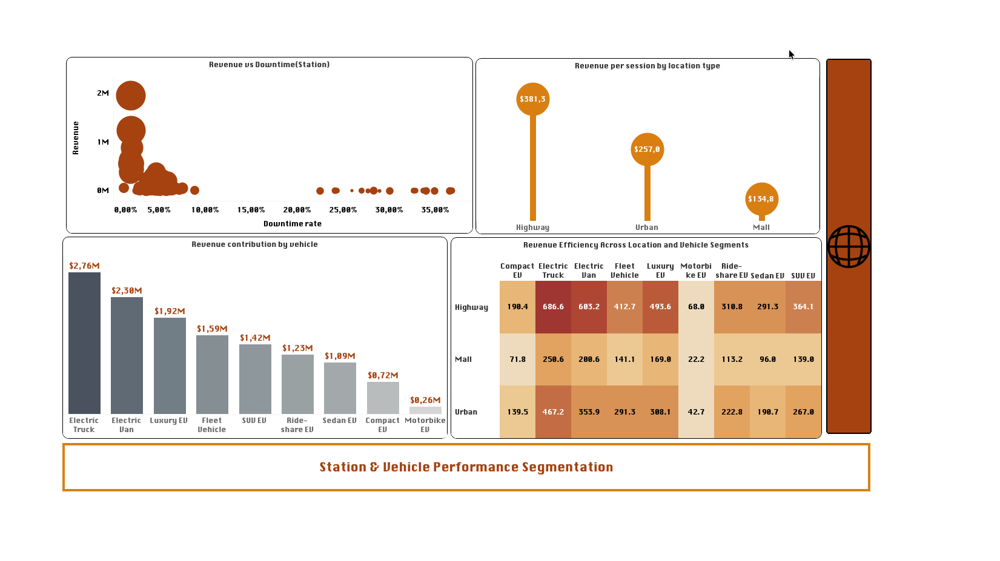

# ⚡ VoltCharge Networks — EV Charging Analytics  
### Global Network Performance, Demand Patterns & Segmentation | Tableau

---

## 🌐 Executive Summary

This project analyzes a global EV charging network to uncover inefficiencies in **infrastructure allocation, pricing, and customer monetization**.

### 🔑 Key Findings
- ⚡ Energy demand varies by **~17x across regions**, showing strong imbalance  
- 🌍 **~49% of revenue is concentrated in 3 cities**, creating dependency risk  
- ⏱️ Peak demand is **~7x higher than off-peak**, highlighting load inefficiencies  
- 👥 **70% of users are low-value (Basic)**, indicating strong upsell potential  
- 🛣️ Highway locations generate **~2.8x higher revenue per session than malls**  
- ⚙️ Station downtime has a **direct negative impact on revenue**  

---

## 🚀 Business Impact

- Enables **data-driven infrastructure expansion**  
- Improves **pricing and revenue efficiency**  
- Optimizes **station uptime and performance**  
- Increases **customer lifetime value (LTV)**  

---

## 🏢 Introduction

**VoltCharge Networks** is a fictional global EV charging provider operating across North America, Europe, and emerging markets.

The company uses a hybrid model combining:
- Pay-per-session charging  
- Subscription tiers (Basic & Premium)  

📊 Key Metrics:
- **20,000 customers**  
- **$13.30M total revenue**  
- **$265.91 average revenue per session**  

Despite strong performance, VoltCharge faces challenges in **efficiency, pricing, and scalability**.

---

## ⚠️ Problem Statement

VoltCharge lacks a unified, data-driven approach to:

- Allocate infrastructure efficiently across regions  
- Identify high-growth vs saturated markets  
- Optimize pricing based on demand  
- Maximize revenue across locations and customer segments  

### 📉 Impact
- Overutilized stations in high-demand regions  
- Underutilized infrastructure in low-demand areas  
- Revenue concentration in a few cities  
- Missed monetization opportunities  

---

## 🎯 Objective

To transform operational data into actionable insights that support:

- Infrastructure optimization  
- Market expansion strategy  
- Pricing efficiency  
- Customer growth and monetization  

---

# 🌍 Global Network Performance

---

## 1. ⚡ Energy Consumption Distribution

### 🔍 Analysis  
Energy consumption ranges from **332K to 5.55M kWh (~17x difference)**.

High-demand regions:
- 🇺🇸 USA, 🇨🇦 Canada  
- 🇳🇴 Norway, 🇳🇱 Netherlands  

Emerging markets:
- 🇮🇳 India, 🇨🇳 China, 🇦🇪 UAE  

---

### 💡 Insight  
Demand is **geographically imbalanced**, strongly linked to infrastructure maturity and EV adoption.

---

### 🎯 Action  
- Optimize efficiency in mature markets  
- Expand infrastructure in emerging regions  
- Apply region-specific strategies  

---

## 2. 💰 Revenue Distribution by City

### 🔍 Analysis  
- Total revenue: **$13.30M**  
- Top cities: Dubai, Toronto, Paris  
- Top 3 cities → **~49% of total revenue**

---

### 💡 Insight  
Revenue is **highly concentrated**, increasing dependency risk.

---

### 🎯 Action  
- Diversify revenue across more cities  
- Replicate successful city models  
- Expand in high-demand urban areas  

---

## 3. ⚖️ Energy vs Revenue (Pricing Efficiency)

### 🔍 Analysis  
Similar energy usage (~3M–4M kWh) produces **different revenue levels**.

---

### 💡 Insight  
Pricing is not aligned with demand, creating **revenue inefficiencies**.

---

### 🎯 Action  
- Implement location-based pricing  
- Adjust tariffs in high-demand areas  
- Align pricing with usage patterns  

---

## 4. ⏱️ Peak Demand Analysis

### 🔍 Analysis  
- Morning peak: ~4,340 sessions  
- Evening peak: ~5,055 sessions  
- Off-peak: ~700 sessions  

➡️ **~7x variation**

---

### 💡 Insight  
Demand follows commuting patterns, causing **peak congestion and off-peak inefficiency**.

---

### 🎯 Action  
- Introduce time-based pricing  
- Optimize station availability  
- Shift demand to off-peak periods  

---

## 5. 👥 Customer Segmentation

### 🔍 Analysis  
- Basic: **70.03% (~14K users)**  
- Premium: **29.97% (~6K users)**  

---

### 💡 Insight  
Most users are **low-value**, limiting revenue potential.

---

### 🎯 Action  
- Upsell high-usage Basic users  
- Introduce Premium incentives  
- Increase customer lifetime value  

---

## 6. 📈 Customer Growth Trend

### 🔍 Analysis  
- January: ~1,038 users  
- Peak: ~2,802 users  
- December: ~2,438 users  

➡️ **~170% growth**

---

### 💡 Insight  
Growth is **non-linear and event-driven**, likely influenced by campaigns or external factors.

---

### 🎯 Action  
- Identify growth drivers  
- Replicate successful campaigns  
- Build predictable acquisition models  

---

## 7. 💵 Revenue Efficiency

### 🔍 Analysis  
- Avg revenue per session: **$265.91**

---

### 💡 Insight  
Revenue per session is strong but key for scaling profitability.

---

### 🎯 Action  
- Optimize pricing strategies  
- Increase Premium adoption  
- Track as core KPI  

---

# 🚗 Station & Vehicle Performance

---

## 1. ⚙️ Revenue vs Downtime

### 🔍 Analysis  
- Low downtime (0–5%) → high revenue  
- High downtime (20–35%) → near-zero revenue  

---

### 💡 Insight  
Downtime directly reduces revenue, making reliability critical.

---

### 🎯 Action  
- Implement predictive maintenance  
- Monitor performance in real time  
- Reduce downtime  

---

## 2. 🛣️ Revenue by Location Type

### 🔍 Analysis  
- Highway: **$381.3**  
- Urban: **$257.0**  
- Mall: **$134.8**  

➡️ **~2.8x difference**

---

### 💡 Insight  
User behavior varies by location:
- Highway → urgency → higher willingness to pay  
- Mall → lower urgency → price sensitivity  

---

### 🎯 Action  
- Apply location-based pricing  
- Expand highway infrastructure  
- Improve low-performing locations  

---

## 3. 🚙 Revenue by Vehicle Type

### 🔍 Analysis  
Top:
- Electric Truck: **$2.76M**  
- Electric Van: **$2.30M**

Low:
- Motorbike EV: **$0.26M**

---

### 💡 Insight  
Commercial vehicles generate higher revenue due to higher energy usage.

---

### 🎯 Action  
- Focus on fleet and commercial segments  
- Adjust pricing for high-consumption users  
- Expand relevant infrastructure  

---

## 4. 🔥 Revenue Efficiency (Vehicle × Location)

### 🔍 Analysis  
- Highest: Trucks on highways (~686.6)  
- Lowest: Motorbikes in malls (~22.2)  

---

### 💡 Insight  
Revenue is maximized when **high-consumption vehicles meet high-value locations**.

---

### 🎯 Action  
- Prioritize high-efficiency combinations  
- Reevaluate low-performing segments  
- Optimize station placement  

---

# 🚀 Final Business Impact

This project enables VoltCharge Networks to:

- Optimize **global infrastructure allocation**  
- Improve **pricing strategy and revenue yield**  
- Reduce **operational inefficiencies**  
- Increase **customer monetization**  
- Enhance **station performance and reliability**  

---

# 🧠 Key Takeaway

Improving **pricing, infrastructure allocation, and operational efficiency** is essential to unlocking the full revenue potential of EV charging networks.

👉 Data-driven insights enable smarter decisions across **growth, performance, and profitability**.
